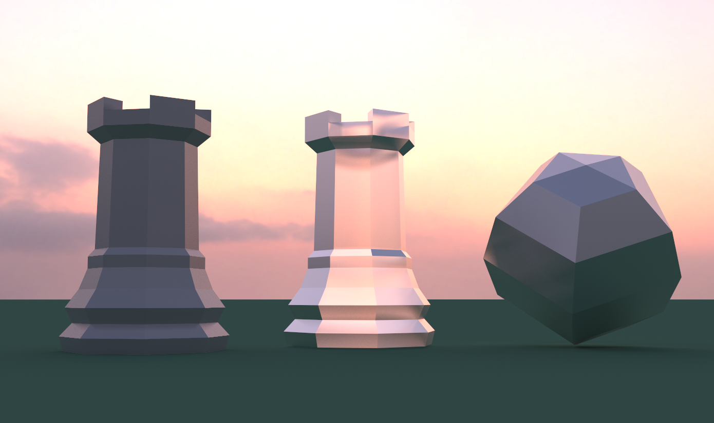
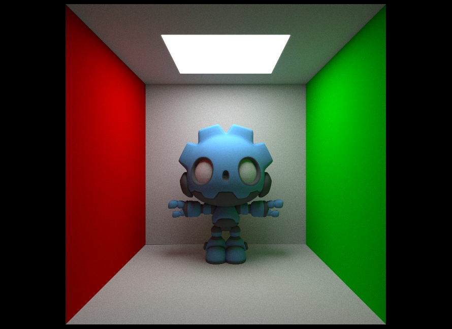
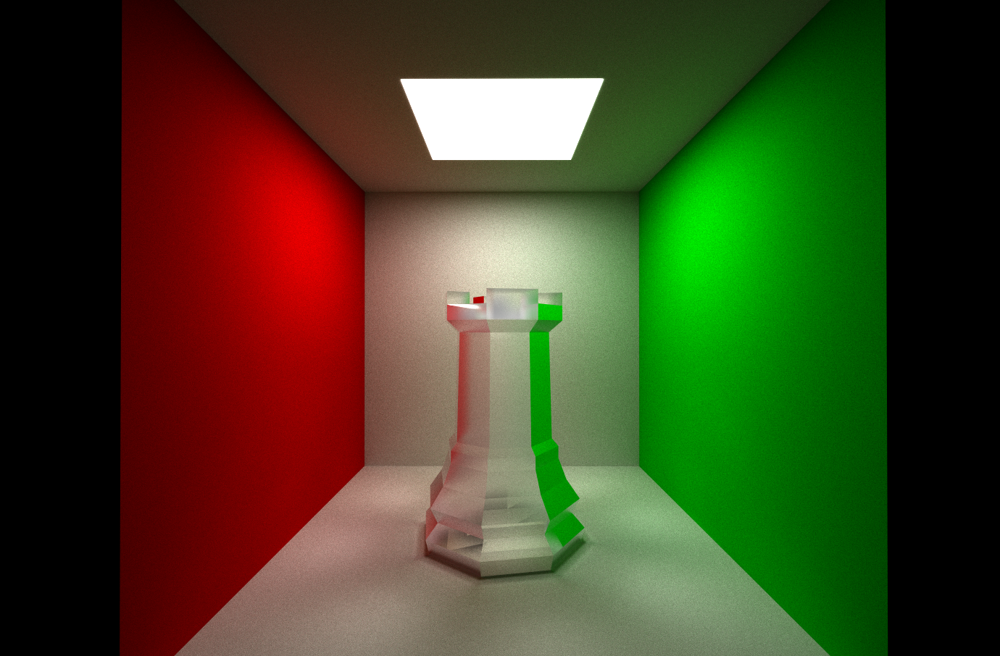
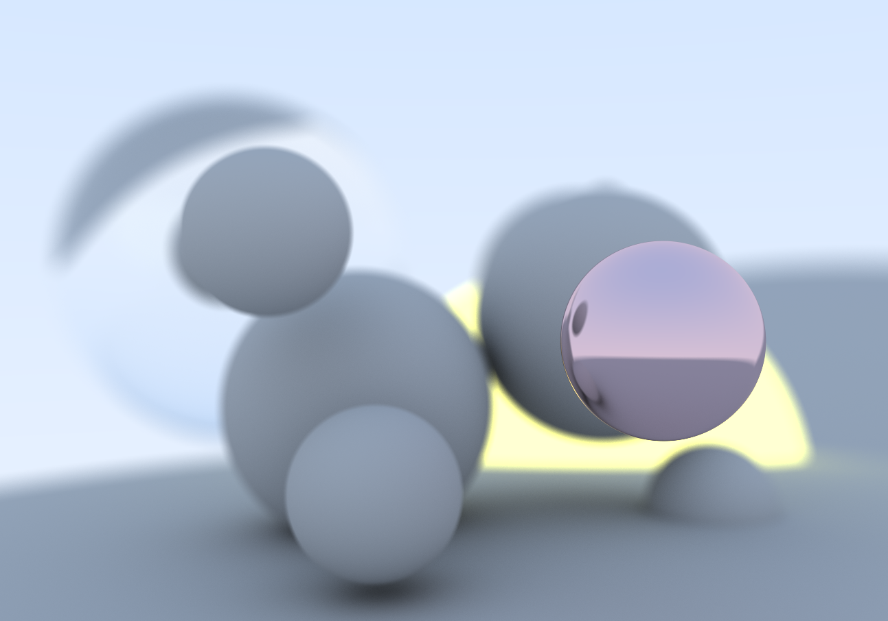

# ComputePathTracer

A compute shader based path tracer implemented in the Godot game engine

## Features

**Path Tracer**: A compute shader based path tracer, implemented from scratch with progressive accumulation for noise reduction across frames.

**Materials**: Multiple material types supported:

- Lambertian (diffuse) with metallic-roughness workflow
- Metallic materials with roughness-based reflections
- Dielectric materials with Schlick's approximation for realistic glass/transparent surfaces
- Emissive materials for light sources

**HDRI Skybox**: The renderer samples the camera's environment PanoramaSkyMaterial with configurable energy/intensity.

**Bounding Volume Hierarchy (BVH)**: A spatial acceleration structure built on the CPU and traversed on the GPU using an iterative stack-based algorithm, dramatically reducing triangle intersection tests for complex meshes.

**Depth of Field**: Physically-based camera model with configurable aperture and focal distance.

**Vertex Interpolation**: Barycentric coordinate interpolation for smooth shading normals, vertex colors, and support for per-vertex attributes.

**Anti-Aliasing**: Multi-sample anti-aliasing (MSAA) with per-pixel jittering for cleaner edges.

**Random Sampling**: PCG-based pseudo-random number generation with proper seed management for stratified sampling and low-noise rendering.

**Configurable Ray Bounces**: Adjustable maximum bounce depth for controlling light transport complexity and performance.

**Debug Visualization Modes**:

- Normal visualization
- Depth visualization
- BVH traversal heatmap for performance analysis

**Gamma Correction**: Proper sRGB gamma correction (2.2) applied to final output for accurate color display.

## Setting up the project
The project uses C++ with the GDExtension API and SCons as the build system.  For setup instructions, refer to the [GDExtension C++ example](https://docs.godotengine.org/en/4.4/tutorials/scripting/gdextension/gdextension_cpp_example.html) on the Godot documentation.

## Future work
- Physically-Based BRDFs: Implement industry-standard BRDFs (e.g., GGX/Trowbridge-Reitz microfacet model).
- Support for loading and sampling albedo, normal, roughness, and metallic texture maps with proper UV coordinate handling.
- Implement Surface Area Heuristic (SAH) for BVH building to achieve better ray traversal performance and reduce intersection tests..

- Post processing pipeline: Bloom and glare effects, tonemapping operators (ACES, Reinhard), exposure control.

- Importance sampling: NEE (Next Event Estimation) and MIS (Multiple Importance Sampling) for faster convergence with emissive objects and HDR environments.

- Advanced materials: Support for subsurface scattering, anisotropic materials and clearcoat layers.

- Instancing support

## Samples

